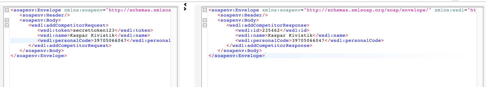
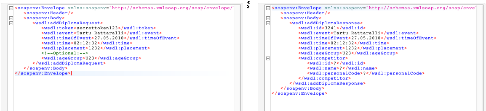
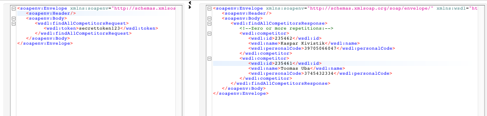
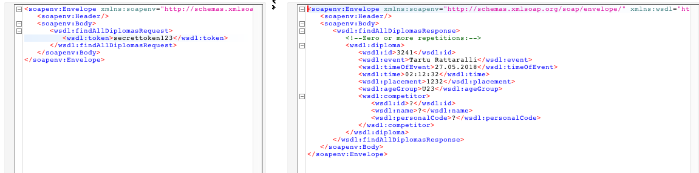
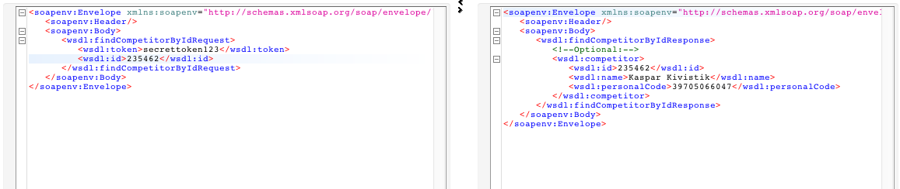
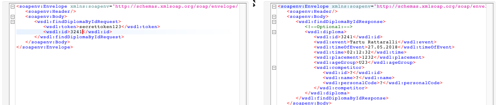
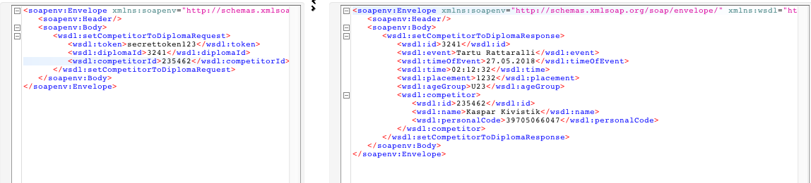
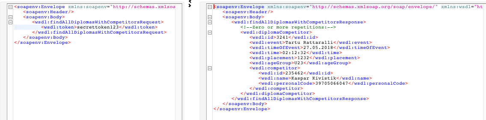

# Cyclingresults

Eesolev rakendus on valminud õppeaine "Veebiteenused" raames. Teenus koosneb SOAP ja REST API-st,
mis on loodud Java Spring Boot raamistikus. Dokumentatsioonis käsitletakse SOAP ja REST API-sid eraldi moodulitena.

## Vajalikud tehnoloogiad

- IDE
- Gradle
- Brauser
- Apache Tomcat

## Käivitamine

```
$ git clone https://github.com/kasparkivistik/cyclingresults.git
$ cd cyclingresults
$ gradle genJaxb --genereerib WSDL järgi klassid
$ gradle bootRun

SoapUI-s käivitamiseks

$ localhost:8080/ws/diploma.wsdl
$ kopeerida see SoapUI WSDL aknasse
```

## Sisukord

1. [Sissejuhatus](#Sissejuhatus)
2. [Teenuse struktuur](#Teenus)
3. [SOAP API dokumentatsioon](#SOAP)
4. [REST API dokumentatsioon](#REST)

## Sissejuhatus

Projekt on koostatud kasutades Spring Boot raamistikku. WSDL ja POJO on genereeritud XSD dokumendist, kasutades JAXB libraryt ja Gradle'it.

## Teenus

Teenus koosneb kahest API-st. SOAP ja REST.
Teenusel on kaks põhiobjekti: _diploma_ (diplom) ja _competitor_ (võistleja).  
Objekt **Diplom** koosneb järgnevatest elementidest:  
- id,
- üritus (_event_),
- ürituse toimumisaeg (_timeOfEvent_),
- osaleja aeg (_time_),
- koht (_placement_),
- vanuseklass (_ageGroup_),
- võistleja (_competitor_)\


Sealhulgas tuleb mainida, et vanuseklass on enumeratsioon, mis koosneb järgnevatest võimalikest valikutest:
- M10
- M12
- M14
- M16
- M18
- U23
- N10
- N12
- N16
- N18
- SEN
- M
- N


Objekt **Võistleja** koosneb järgnevatest elementidest:  
- id,
- nimi (_name_),
- isikukood (_personalCode_)

Kõik objektidega tehtavad operatsioonid on kasutatavad nii SOAP kui ka REST APIs. Teenuses kasutataske idemptsuse printsiipi, ehk iga päringuga on kohustuslik anda kaasa API token, ilma milleta päringut ei rahuldata.
Kui üldiselt API token antaks kaasa näiteks autoriseerimisel, on käesolevas projektis see _hardcodetud_ sisse tekstivälja "secrettoken123" nimel.
\
Kuna mõlemad APId kasutavad sama "andmebaasi", siis on nad seotud ühise _repositoryga_, mistõttu SOAP _service_ meetodid võtavad sisse sama objekti, mis REST API, aga väljastavad WSDLis määratud _Response_ objekti.
## SOAP

API koosneb kaheksast operatsioonist:
- addCompetitor
- addDiploma
- findAllCompetitors
- findAllDiplomas
- findCompetitorById
- findDiplomaById
- setCompetitorToDiploma
- findAllDiplomasWithCompetitors


1. addCompetitor

Teenus lisab võistleja andmebaasi. Teenuse käigus genereeritakse võistlejale automaatselt ID, nime ja isikukoodi peab klient ise määrama.
ID on long andmetüüpi, nimi ja isikukood on string andmetüüpi. Muidugi ei saa ära unustada tokenit, mis käib kaasas iga teenusega. Edaspidi ma seda esile tooma ei hakka.


Teenuse väljund tagastab süsteemile uue võistleja ID, nime ja isikukoodi. Täpselt samad andmed, mis süsteemile ka esitati.




2. addDiploma

Teenus lisab diplomi andmebaasi. Teenuse käigus genereeritakse diplomile automaatselt ID, võistluse nime, võistleja aja, võistluse toimumise aja, vanuseklassi ja koha peab klient ise seadistama.
Võistluse nimi on string andmetüüpi, võistleja aeg ja võistluse toimumise hetk on vastavalt time ja dateTime, vanusegrupp on stringidest koosnev enumeratisioon ja koht on long.

Teenus tagastab sama informatsiooni, mis klient süsteemi lisas, lisaks veel automaatne ID ja olenemata olemasolule võistleja, kellega diplom seotud on.





3. findAllCompetitors

Teenus tagastab kõik andmebaasi registreeritud võistlejad. Tagastatakse võistleja ID, nimi ja isikukood (_Competitor_ objekt).




4. findAllDiplomas

Teenus tagastab kõik andmebaasi registreeritud diplomid. Tagastatakse _Diploma_ objekt.




5. findCompetitorById

Teenus leiab võistleja ID järgi võistleja objekti. Tagastatakse _Competitor_ objekt.




6. findDiplomaById

Teenus leiab diplomi ID järgi diplomi objekti. Tagastatakse _Diploma_ objekt.





7. setCompetitorToDiploma

Teenus lisab diplomile võistleja. Tagastatakse _Diploma_ objekt, kuhu _Competitor_ objekt juurde lisati.




8. findAllDiplomasWithCompetitors

Teenus tagastab kõik diplomid, kuhu on määratud võistleja. Seega tagastatakse _Diploma_ objekt, kus _Competitor_ pole **null**.




## REST

REST API on dokumenteeritud kasutades Swagger UId.
Swagger on kättesaadav [SIIN](http://localhost:8080/swagger-ui.html) pärast Spring Booti rakenduse käivitamist.\
Samuti on võimalik Swagger UIst näha teenuses kasutatud mudelite disaini (_Competitor_ ja _Diploma_ objekte).


## Lisamärkmed

11.05: projekt on veel pooleli. Miskipärast REST service POST meetodid tagastavad null-objekti. Parandan selle esimesel võimalusel ära. Vabandan. 

21.05: REST toimib. Väga loll viga.

25.05: Kõik peale setCompetitorToDiploma toimib SOAP poole pealt. 

26.05: Meetodit väljakutsudes, palun kontrollige üle, kas järjekord on õige... setCompetitorToDiploma töötab!